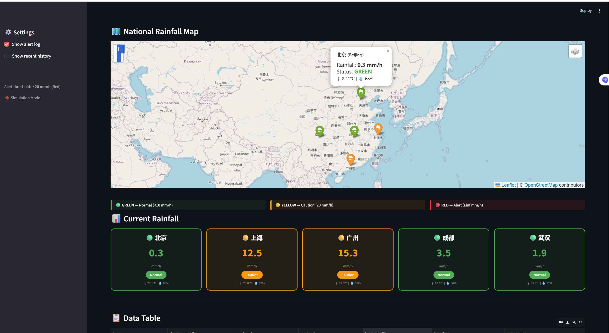

# Project 1 - Short-term Rainfall Forecasting and Alert System

This experiment builds a multi-city rainfall monitoring dashboard for urban flood warning. It integrates OpenWeatherMap data when an API key is available and falls back to simulation mode for demonstration.

## Key Features

- Fetches current rainfall, temperature, and humidity for five Chinese cities.
- Converts OpenWeather `3h` rainfall totals into hourly intensity when needed.
- Classifies rainfall into green, yellow, and red warning levels.
- Logs heavy-rainfall alerts with timestamped entries.
- Displays a Folium rainfall map, color-coded city cards, and optional history table.
- Supports a 5-minute refresh cadence when `streamlit-autorefresh` is installed.

## Files

- `weather_monitor.py` - Streamlit dashboard and alert logic.
- `export_map.py` - Static map export helper.
- `rainfall_history.csv` - Sample monitoring history.
- `alert_log.txt` - Sample alert log.
- `rainfall_map.html` - Exported map artifact.
- `screenshots/` - Interaction screenshots and dashboard preview.

## Run

```bash
pip install -r requirements.txt
streamlit run weather_monitor.py
```

Set `OPENWEATHER_API_KEY` in the environment or Streamlit secrets for live weather data. Without a key, the app runs in simulation mode.

## Preview


