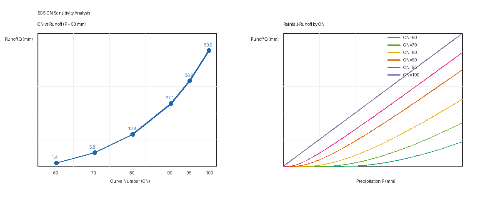

# Project 2 - SCS-CN Runoff Calculation

This experiment implements the Soil Conservation Service Curve Number method for estimating direct runoff from rainfall.

## Key Features

- Implements `calculate_runoff(P, CN)` with scalar and NumPy-array support.
- Handles physical boundary conditions:
  - `P <= Ia` gives `Q = 0`.
  - `CN = 0` represents complete infiltration.
  - `CN = 100` represents impervious surface and gives `Q = P`.
  - `Q` is never allowed to exceed precipitation.
- Includes tests for standard cases, edge cases, and vectorized input.
- Generates a sensitivity plot for fixed rainfall and multiple CN curves.
- Uses a Pillow fallback plotter when matplotlib is unavailable.

## Files

- `scs_cn.py` - Main SCS-CN implementation.
- `test_scs_cn.py` - Boundary-condition test suite.
- `sensitivity_analysis.py` - Sensitivity visualization script.
- `scs_cn_sensitivity.png` - Generated result figure.

## Run

```bash
pip install -r requirements.txt
python sensitivity_analysis.py
pytest test_scs_cn.py
```

## Result Figure


