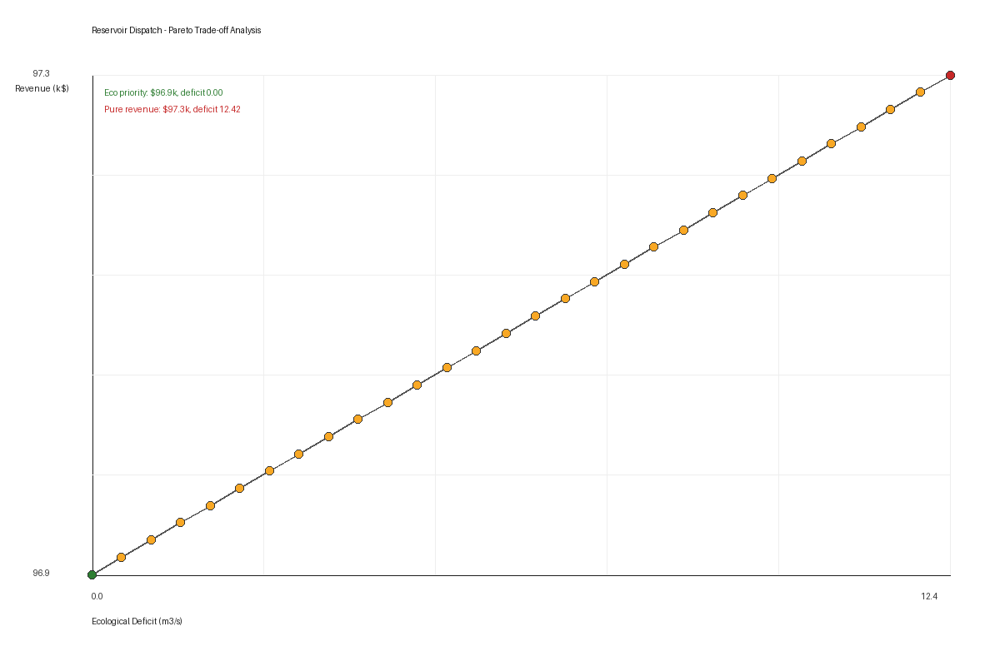

# Reservoir Dispatch Optimization

**Specialized Experiment 3 · Xi'an Jiaotong University · Software Development 2026**

Seven-day reservoir release optimization balancing hydropower revenue and downstream ecological release. The workflow solves a constrained dispatch problem, exports the optimal schedule, plots the revenue-ecology trade-off, and verifies all physical constraints.

---

## Optimization Setup

| Component | Definition |
| --- | --- |
| Decision variables | Daily releases for 7 days |
| Objective | Maximize hydropower revenue and compare ecological deficit |
| Release bounds | `0-100 m3/s` for comparison; `10-100 m3/s` for ecological hard constraint |
| Storage bounds | `100,000-1,000,000 m3` |
| Mass balance | `V(t+1) = V(t) + (inflow - release) * dt` |

---

## What's Inside

| File | Role |
| --- | --- |
| `reservoir_optimization.py` | Optimization, fallback solver, validation, and plotting workflow |
| `optimal_schedule.csv` | Seven-day release schedule |
| `optimal_schedule_report.txt` | Text summary of optimal dispatch results |
| `validation_report.txt` | Storage, release, and mass-balance verification report |
| `tradeoff_analysis.png` | Revenue vs. ecological-deficit trade-off figure |
| `Experiment3_Reservoir_Optimization.docx` | Original experiment task document |
| `report.tex` | Overleaf-ready experiment write-up |
| `requirements.txt` | Python dependencies |

---

## Run It

```bash
# clone and open this project
git clone https://github.com/HuangQiwei123/QiweiHuang-s-homeworks.git
cd QiweiHuang-s-homeworks
git checkout project-3
cd Project-3-Water-Resources-Optimization-Reservoir-Dispatch

# install
pip install -r requirements.txt

# solve and validate
python reservoir_optimization.py
```

---

## Development Notes

Built through iterative AI-assisted optimization:

- Round 1 -- Reservoir mass-balance formulation and objective function.
- Round 2 -- SLSQP constrained optimization and validation report.
- Round 3 -- Pareto-style trade-off analysis and robust fallback solver.

For strict grading, install the dependencies in `requirements.txt`: the script prioritizes SciPy SLSQP whenever SciPy is available. The linear fallback is only a reproducibility safeguard for lightweight environments without SciPy or Matplotlib; it is reported explicitly in the console output and is not presented as the primary optimization method.

---

## Result Preview

The trade-off figure summarizes how hydropower revenue changes as ecological deficit is relaxed, making the operating-policy compromise easy to inspect.



---

*Huang Qiwei · 3125301141 · Software Development · Xi'an Jiaotong University · 2026*
