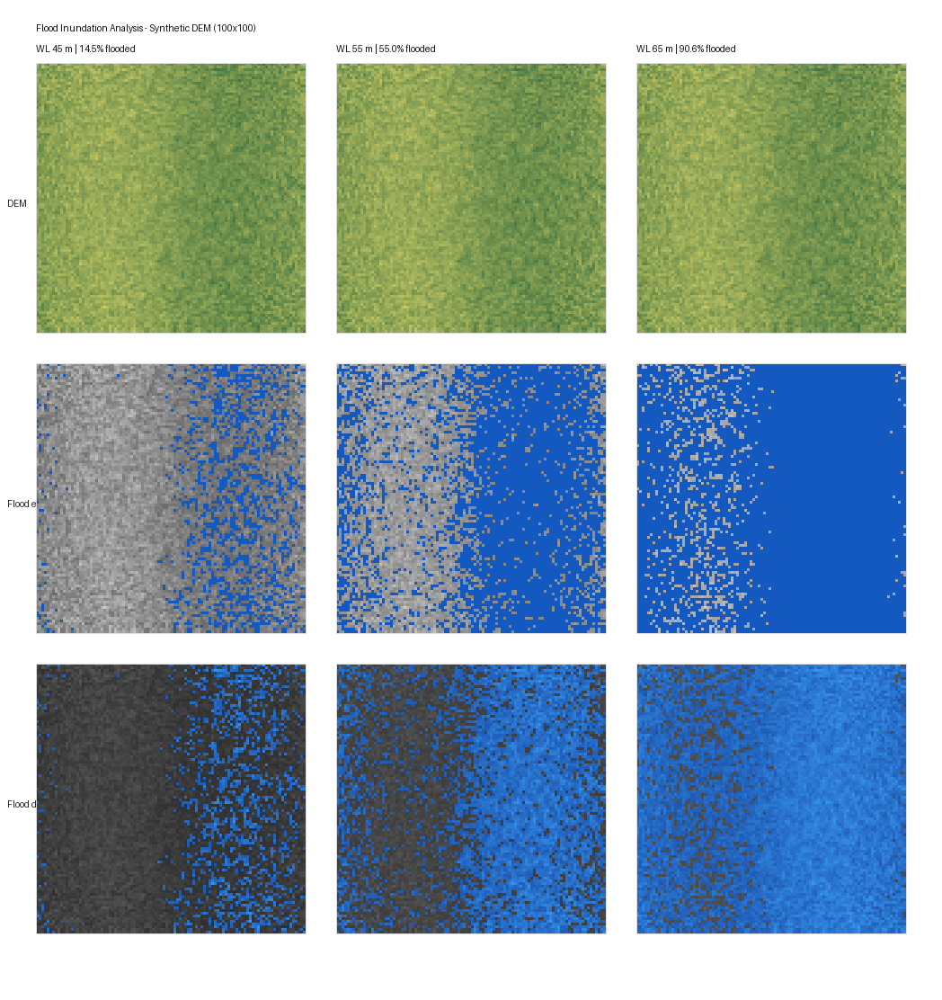
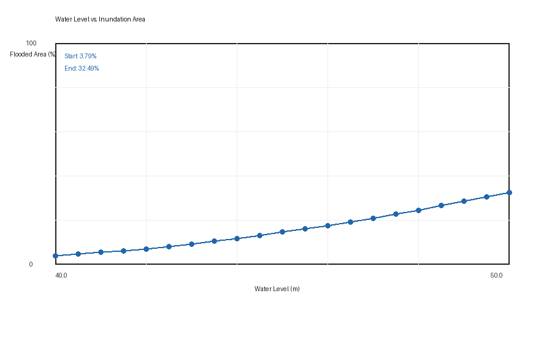

# Project 4 - Flood Inundation Analysis

This experiment performs DEM-based flood inundation analysis with synthetic 100 x 100 terrain data.

## Key Features

- Loads DEM data from `.npy` or `.csv`.
- Calculates flooded mask, flood depth, inundated area percentage, and total flood volume.
- Simulates rising water levels and verifies monotonic flood-area growth.
- Generates flood extent, depth, and trend visualizations.
- Includes a physical-sense validation workflow across 101 water levels.
- Uses Pillow fallback plotting when matplotlib is unavailable.

## Files

- `generate_dem.py` - Synthetic DEM generator.
- `flood_inundation.py` - Core flood calculation functions.
- `visualize_flood.py` - DEM, flood extent, and depth visualization.
- `flood_trend.py` - Rising-water trend analysis.
- `validate_flood.py` - Physical validation suite.
- `write_report.py` - DOCX report generator.
- `dem_synthetic_100x100.npy` / `.csv` - DEM data.
- `flood_inundation_plot.png` - Flood map comparison figure.
- `flood_trend_curve.png` - Water-level trend curve.

## Run

```bash
pip install -r requirements.txt
python generate_dem.py
python visualize_flood.py
python flood_trend.py
python validate_flood.py
```

## Result Figures




